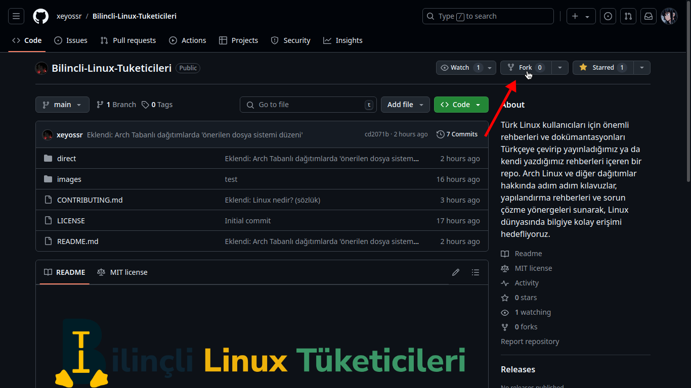
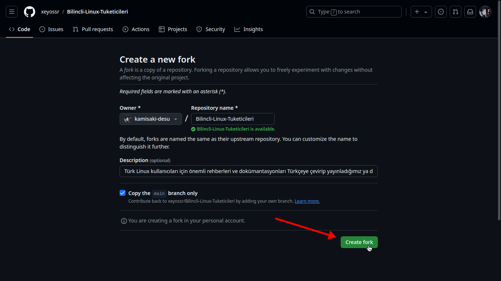
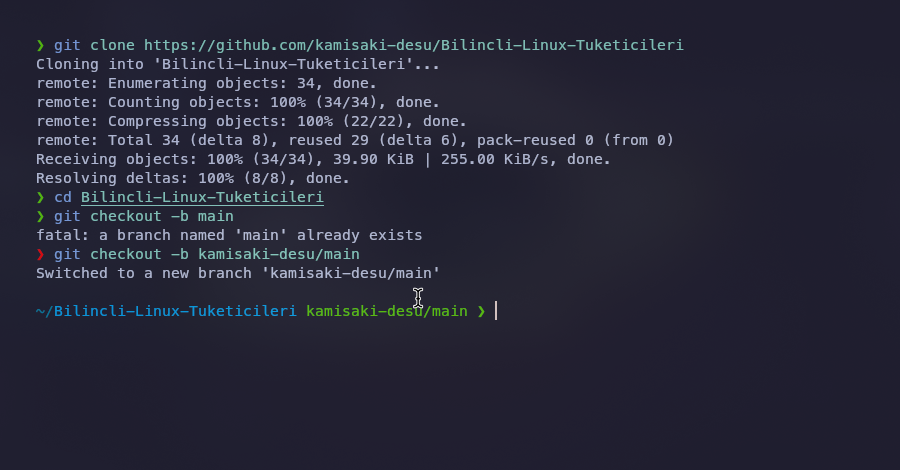
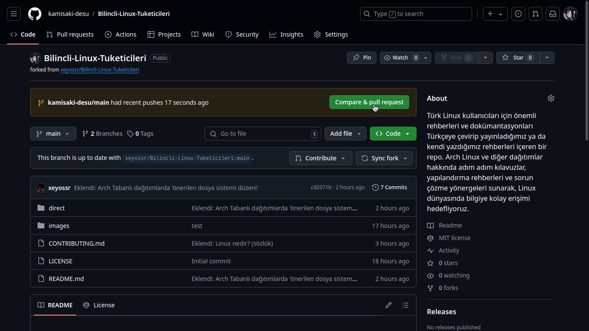
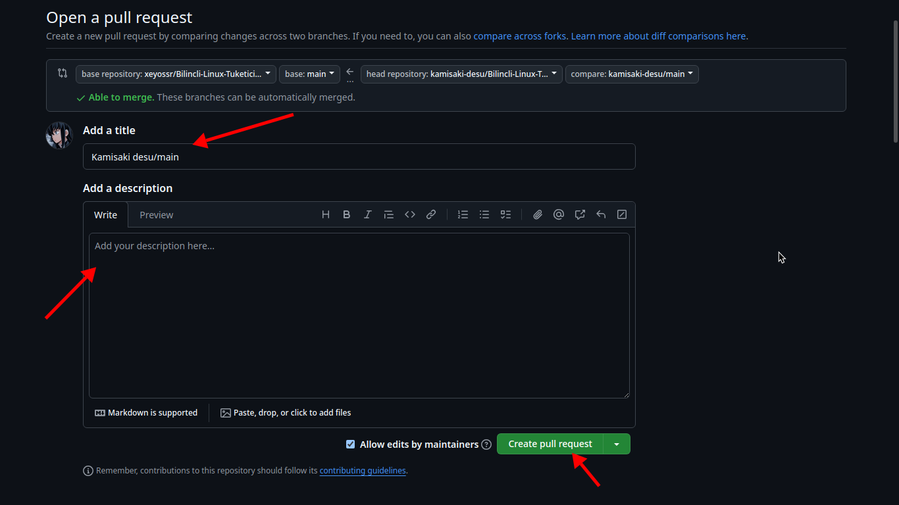

# Nasıl pull request oluşturulur?

Öncelikle repoyu forklayın:



Repoyu forkladığınız zaman reponun bir kopyası GitHub hesabınızda da oluşacaktır. Kendi GitHub sayfanızda oluşan repoyu bilgisayarınıza klonlayın. Daha sonra reponun klonlandığı klasöre geçiş yapıp yeni bir branch oluşturup branche geçiş yapın.

```bash
git clone https://github.com/UserName/RepoName.git Bilincli-Linux-Tuketicileri
cd Bilincli-Linux-Tuketicileri
git checkout -b UserName/main
```



Bu aşamadan sonra projede yapmak istediğiniz değişiklikleri yapıp commit atın ve reponuza gönderin.

```bash
git add newFile.md
git commit -m "Eklendi: newFile.md"
git push origin UserName/main
```

Bu aşamadan sonra işlemlerimize GitHub üzerinden devam etmemiz gerekiyor. Kendi sayfamızdaki repoya tekrar baktığımızda bu sefer bir uyarı mesajı göreceğiz.




Pull request gönderirken [CONTRIBUTING](CONTRIBUTING.md) sayfasındaki kurallara uyduğunuzdan emin olun.
